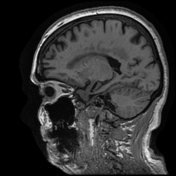
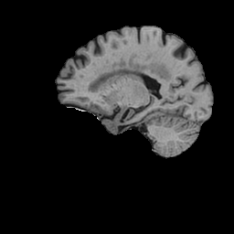
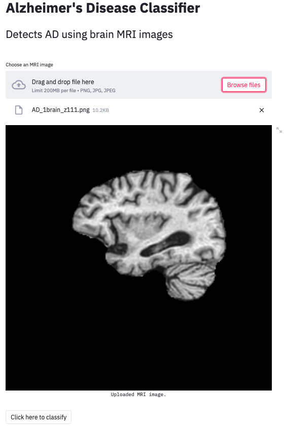
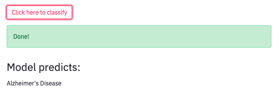

---
#### This work is performed using convolutional neural network to predict Alzheimer's disease using brain MRI images from the [Alzheimer's Disease Neuroimaging Initiative (ADNI)](http://adni.loni.usc.edu/). 

---
# Table of Contents
- [Problem Statement](#Problem-Statement)
- [Requirements](#Requirements)
- [Dataset](#Dataset)
- [Image Extraction](#Image-Extraction)
- [Image Preprocessing](#Image-Preprocessing)
- [Models Summary](#Models-Summary)
- [Interactive AD Predection Model](#Interactive-AD-Predection-Model)
- [Conclusions](#Conclusions)
- [Future Directions](#Future-Directions)
- [References and Data Sources](#References-and-Data-Sources)

# Problem Statement
Can we detect Alzheimer’s disease using brain MRI?

Alzheimer's disease (AD) is a progressive neurodegenrative disease that affects memory, language processing, reasoning, and social behaviors. Patients with AD will have a progressive loss of brain structure due to neuronal death. The hippocampus and entorhinal cortex are first regions to be affected in AD patients, and in later stages the cerebral cortex get affected as well.

AD affects around 44M patients around the world, and 5.5M in the US alone. 

Early and accurate detection of AD allows for early management of the disease and therefore, delaying it's onset. 

# Requirements
- [Python 3.5 and above](https://www.python.org/)
- [Tensorflow](https://www.tensorflow.org/)
- [Scikit-learn](https://scikit-learn.org/stable/)
- [opencv-python](https://pypi.org/project/opencv-python/)
- [Deepbrain](https://pypi.org/project/deepbrain/)
- [Nibabel](https://pypi.org/project/nibabel/)
- [nii2png](https://pypi.org/project/nii2png/)

# Dataset
As mentioned earlier, this dataset was provided by ADNI. It contains ~10K T1 MRI images from 117 AD subjects, and ~12K T1 MRI images from 117 cognitive normal (CN) subjects. All MRI images were in the sagittal orientation.

# Image Extraction
Brain MRI images are provided by ADNI as NIFTI files. NIFTI files contain 160-170 T1-MRI images per subject representing slices of the brain 1.2 mm apart. 

IN order to extract these png images from each NIFTI file, I used a library called [nii2png](https://pypi.org/project/nii2png/). I modified this library for my own purposes. 

# Image Preprocessing
All extracted png images were resized, and skull and other tissues were stripped using [Deepbrain](https://pypi.org/project/deepbrain/) library.

Here is an example of the resulted extracted brains:

  

 - - - 

# Models Summary
Several CONV2D models were designed to improve the accuracy of our model. Baseline model accuracy was 50%.

My best performing [model](https://github.com/ferastwal/AD-Predictions-Capstone-Project/blob/main/code/modeling-with-skull-stripped-images/FINAL-TL-model-BatchNorm.ipynb) was using VGG16 transfer learning model with BatchNormalization. Results were as follows, training loss: 0.0288 - training accuracy: 0.9937 - val_loss: 0.1693 - val_accuracy: 0.9345. Precision score was ~89%, and sensitivity score (recall) was ~71%.

Overall, these are desent results although we have some overvitting issues. Future steps will be discussed below to improve our model's performance.

# Interactive AD Predection Model
[Streamlit](https://www.streamlit.io/) was utilized to build an interactive app to predict AD.

**You can upload your MRI image as shown below.**

**Then you can click the button to classify and the app would give a prediction.**

***In order to use the interactive AD Predector, please download the github repo and run `AD_app.py` file in the [demo app](https://github.com/ferastwal/AD-Predictions-Capstone-Project/tree/main/AD-predector-demo-app) folder.***

# Conclusions

- Skull stripping improved models' performance
- VGG16 TL model with BatchNormalization performed the best with val_accuracy of 0.9345 and val_loss of 0.1693
- The Model was better at predicting AD (precision = ~89%) than CN (recall = ~71%), which is an issue that needs to be addressed in the future

# Future Directions
- Using more modalities (coronal and axial orientations, PET scans, etc)
- More imaging preprocessing (standardizing brightness and contrast, grayscaling..etc) could be done to improve our predictions
- Using CONV3D model instead of CONV2D
- Other tansfer learning models are also available and can be used to improve our predictions

# References and Data Sources
## References
1. [Alzheimer's Disease Facts and Figures annual report](https://www.alz.org/alzheimers-dementia/facts-figures)
2. [Alzheimer Disease in 2020](https://www.ncbi.nlm.nih.gov/pmc/articles/PMC3543098/)
3. [What is Alzheimer’s Disease?](https://www.alz.org/alzheimers-dementia/what-is-alzheimers)
4. [Fast Robust Automated Brain Extraction](https://www.ncbi.nlm.nih.gov/pmc/articles/PMC6871816/pdf/HBM-17-143.pdf)

## Data Sources
- [Alzheimer's Disease Neuroimaging Initiative (ADNI)](http://adni.loni.usc.edu/)